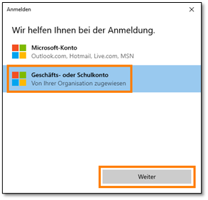
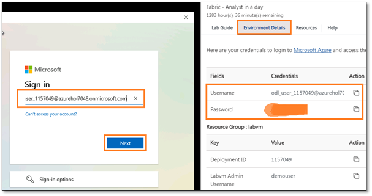
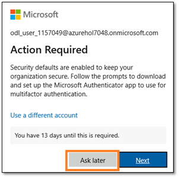
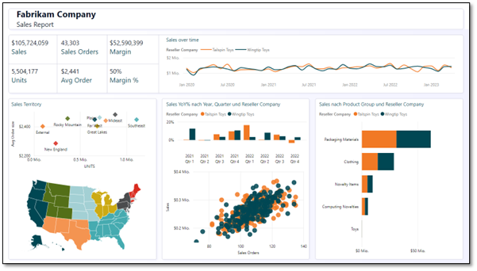
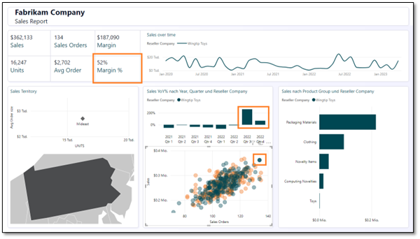
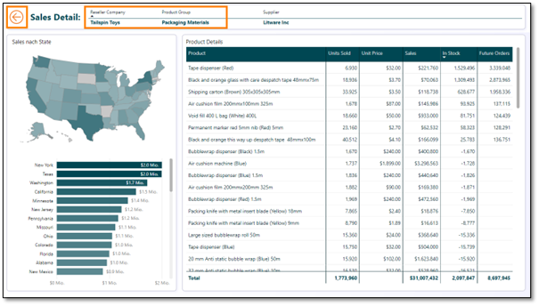
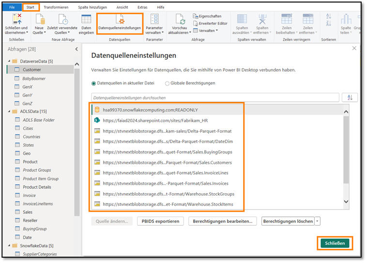
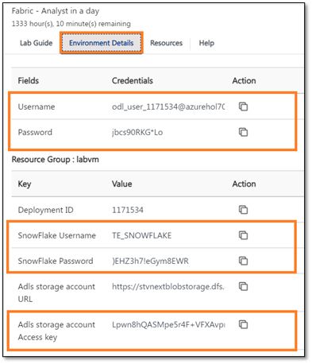

# Inhalt 

- Dokumentstruktur
- Anwendungsfall/Problemstellung
- Überblick über den Power BI Desktop-Bericht
   - Aufgabe 1: Power BI Desktop in einer Übungsumgebung einrichten
   - Aufgabe 2: Power BI Desktop-Bericht analysieren
   - Aufgabe 3: Power Query-Abfragen überprüfen
- Referenzen

# Dokumentstruktur

Die Übung enthält die Schritte, die der Benutzer durchführen muss, sowie zugehörige Screenshots zur visuellen Unterstützung. Wichtige Abschnitte sind in den Screenshots mit einem orangefarbenen Kasten gekennzeichnet.

# Anwendungsfall/Problemstellung

Fabrikam, Inc. vertreibt Livestyle-Artikel. Die Kunden von Fabrikam sind zumeist Unternehmen, die die Artikel an den Endverbraucher weiterverkaufen. Fabrikam verkauft an Einzelhandelskunden in den USA, darunter Fachgeschäfte, Supermärkte, Computergeschäfte und Souvenirläden. Fabrikam vertreibt seine Waren über ein Netzwerk von Vertretern, die die Produkte im Namen von Fabrikam bewerben, auch an andere Großhändler. Derzeit sind alle Kunden von Fabrikam in den USA ansässig. Das Unternehmen plant aber eine Expansion in andere Länder oder Regionen.

Sie arbeiten als Data Analyst im Vertriebsteam. Ihre Aufgabe ist das Sammeln, Bereinigen und Auswerten von Datasets zur Lösung geschäftlicher Probleme. Außerdem fertigen Sie Diagramme und Visualisierungen an, schreiben Berichte und präsentieren diese den Entscheidungsträgern in der Organisation.

Um wertvolle Erkenntnisse aus den Daten zu ziehen, rufen Sie Daten aus mehreren Systemen ab, bereinigen diese und führen sie zusammen. Dabei beziehen Sie folgende Daten aus folgenden Quellen:

- **Vertriebsdaten:** Diese stammen aus dem ERP-System und werden in einer ADLS Gen2-Datenbank oder in Databricks abgelegt. Jeden Tag um 12 Uhr mittags werden die Daten aktualisiert.
- **Lieferantendaten:** Diese kommen von verschiedenen Lieferanten und werden in einer Snowflake-Datenbank gespeichert. Jeden Tag um Mitternacht werden die Daten aktualisiert.
- **Kundendaten:** Diese stammen aus Customer Insights und werden in Dataverse gespeichert. Die Daten sind immer auf dem neuesten Stand.
- **Mitarbeiterdaten:** Diese stammen aus dem Personalsystem und werden als Exportdatei in einem SharePoint-Ordner gespeichert. Die Daten werden jeden Morgen um 9 Uhr aktualisiert. 

    
 

Derzeit arbeiten Sie an einem Dataset in Power BI Premium, mit dem die Daten aus den oben genannten Quellsystemen abgerufen werden sollen, damit Sie Ihre Berichte schreiben können und Endanwender die Möglichkeit erhalten, Self-Service-Angebote zu nutzen. Das Modell aktualisieren Sie mit Power Query. 

#### Nun sind Sie mir folgenden Problemen konfrontiert:

- Das Dataset muss mindestens dreimal täglich aktualisiert werden, um den verschiedenen Aktualisierungszeiten der Datenquellen Rechnung zu tragen.
- Die Aktualisierungen dauern lange, weil die Daten jedes Mal komplett aktualisiert werden müssen, um alle Änderungen an den Daten in den Quellsystemen zu erfassen.
- Tritt in den Datenquellen, aus denen die Daten abgerufen werden, ein Fehler auf, wird die DataSet-Aktualisierung abgebrochen. Oftmals wird die Mitarbeiterdatei nicht pünktlich hochgeladen, was ebenso zum Abbruch der DataSet-Aktualisierung führt. 
- Änderungen am Datenmodell nehmen sehr viel Zeit in Anspruch, weil Power Query aufgrund der großen Datenmenge und des aufwändigen Transformationsvorgangs sehr lange braucht, um die Vorschauversionen zu aktualisieren. 
- Für Power BI Desktop brauchen Sie einen PC mit Windows, auch wenn im Unternehmen Mac-Geräte genutzt werden.

Sie haben von Microsoft Fabric gehört und möchten es gerne ausprobieren, um all diese Probleme zu lösen.

# Überblick über den Power BI Desktop-Bericht
Bevor wir mit Fabric beginnen, sehen wir uns den aktuellen Bericht in Power BI Desktop an, um die Transformationen und das Modell zu verstehen.

## Aufgabe 1: Power BI Desktop in einer Übungsumgebung einrichten

1. Öffnen Sie in der Übungsumgebung auf dem **Desktop** im Ordner **Report** die Datei **FAIAD.pbix**. Die Datei wird in Power BI Desktop geöffnet.

    

2. Geben Sie im Dialogfeld Ihre E-Mail-Adresse ein. Öffnen Sie rechts in der Übungsumgebung die Registerkarte **Environment Details**.
3. Kopieren Sie **Username** und **Credentials**, und fügen Sie beides im Dialogfeld in das Textfeld für die E-Mail-Adresse ein.
4. Wählen Sie **Continue** aus.

    
 
5. Das Dialogfeld für die Anmeldung wird geöffnet. Wählen Sie **Geschäfts- oder Schulkonto** aus.
6. Wählen Sie **Weiter** aus.

    
 
7. Das Dialogfeld „Anmelden“ wird geöffnet. Geben Sie **Username** und **Credentials** erneut ein, indem Sie beides aus der Registerkarte **Environment Details** kopieren.
8. Wählen Sie **Next** aus.

    
 
9. Geben Sie im nächsten Dialogfeld erneut das **Password** und die **Credentials** ein, indem Sie beides aus der Registerkarte **Environment Details** kopieren.
10. Wählen Sie **Anmelden** aus.
11. Das Dialogfeld „Action Required“ wird geöffnet. Darin werden Sie aufgefordert, die Multifaktor-Authentifizierung einzurichten. Weil dies eine Übungsumgebung ist, müssen wir das nicht tun. Wählen Sie **Ask Later** aus.

    
 
12. Wählen Sie im nächsten Dialogfeld die Option **Nein, nur in der App anmelden** aus. Nun wird Power BI Desktop geöffnet.

## Aufgabe 2: Power BI Desktop-Bericht analysieren

Im nachstehenden Bericht werden die Verkäufe von Fabrikam analysiert. Die KPIs stehen oben links auf der Seite. Die restlichen Visuals zeigen die Verkaufszahlen im Laufe der Zeit, nach Gebiet, Produktgruppe und Wiederverkäuferfirma. 

 
**Hinweis:** Bei diesem Training geht es um die Erfassung, Transformation und Modellierung von Daten mithilfe der in Fabric verfügbaren Tools. Es geht weder um die Anfertigung von Berichten noch die Navigation. Sehen wir uns den Bericht kurz an und fahren dann fort.

1. Analysieren wir die Daten nach dem Vertriebsgebiet. Wählen Sie im Streudiagramm **Sales Territory** die Region „New England“ aus. Unter „Sales over time“ sehen Sie, dass der Handelspartner Tailspin Toys im Vergleich zu Wingtip Toys in Neuengland mehr Verkäufe erzielt. Wenn Sie sich das Säulendiagramm „Sales YoY%“ ansehen, werden Sie feststellen, dass das Umsatzwachstum von Wingtip Toys im vergangenen Jahr gering war und von Quartal zu Quartal weniger wurde. Nach einer kleinen Erholung im dritten Quartal ging es im vierten Quartal wieder bergab.

    
 
2. Vergleichen wir dies mit dem Vertriebsgebiet „Rocky Mountain“. Wählen Sie im Streudiagrammvisual **Sales Territory** die Region „Rocky Mountain“ aus. Beachten Sie im Säulendiagramm „Sales YoY%“, dass die Umsätze von Wingtip Toys im vierten Quartal 2022 enorm zugelegt haben, nachdem sie in den beiden vorangegangenen Quartalen niedrig waren.

    
 
3. Wählen Sie im Streudiagramm **Sales Territory** die Region „Rocky Mountain“ aus, um den Filter zu entfernen.
4. Wählen Sie im Streudiagrammvisual unten in der Mitte des Bildschirms (Sales Orders by Sales) den Ausreißer oben rechts aus (4. Quadrant). Beachten Sie, dass die Marge % 52 % beträgt, was über dem Durchschnitt von 50 % liegt. Außerdem ist der Umsatz im Jahresvergleich in % in den letzten beiden Quartalen des Jahres 2022 gestiegen.

    
 
5. Wählen Sie im Streudiagrammvisual den Handelspartner mit dem Ausreißer aus, um den **Filter zu entfernen**.

6. Sehen wir nun die Produktinformationen nach Produktgruppe und Wiederverkäufer an. Klicken Sie im Balkendiagrammvisual „Sales by Product Group and Reseller Company“ mit der rechten Maustaste auf den Balken **Packaging Materials** von Tailspin Toys, und wählen Sie im Dialogfeld die Option **Drillthrough ausführen -> Product Detail** aus.
 
    

Sie gelangen zu der Seite mit den Produktinformationen. Dort sind auch einige zukünftige Bestellungen aufgeführt.

7. Sobald Sie die Informationen gelesen haben, wählen Sie oben auf der Seite den **STRG+Zurückpfeil** aus, um zum Umsatzbericht zurückzukehren.

    
 
8. Sehen Sie sich den Bericht gerne noch genauer an. Anschließend betrachten wir die Modellansicht. Wählen Sie links das **Symbol für die Modellansicht** aus. Beachten Sie, dass es zwei Faktentabellen gibt: Sales und PO. 
    
    a. Die Genauigkeit der Sales-Daten richtet sich nach Date, Reseller, Product und People. Date, Reseller, Product und People sind mit Sales in Zusammenhang gesetzt.

    b. Die Genauigkeit von PO-Daten richtet sich nach Date, Product und People. Date, Product und People sind mit PO in Zusammenhang gesetzt.
    
    c. Wir haben Supplier-Daten nach Product. Supplier steht mit Product in Zusammenhang.
    
    d. Wir haben Reseller-Standortdaten nach Geo. Geo steht in Zusammenhang mit Reseller.
    
    e. Wir haben Customer-Informationen nach Reseller. Customer steht in Zusammenhang mit Reseller. 

## Aufgabe 3: Power Query-Abfragen überprüfen
1. Beschäftigen wir uns in Power Query mit den Datenquellen. Klicken Sie im Menüband auf **Start > Daten transformieren**.

    
 
2. Das Power Query-Fenster wird geöffnet. Wählen Sie im Menüband die Option **Start -> Datenquelleneinstellungen** aus. Das Dialogfeld mit den Datenquelleneinstellungen wird geöffnet. Wenn Sie durch die Liste blättern, werden Sie sehen, dass es vier Hauptquellen gibt, die in der Problemstellung genannt sind:
    
    a.	Snowflake
    
    b.	SharePoint
    
    c.	ADLS Gen2
    
    d.	Dataverse

3. Schließen Sie das Dialogfeld mit den Einstellungen für die Datenquellen mit **Schließen**.

    
 
4. Beachten Sie, dass die Abfragen auf der linken Seite nach Datenquelle angeordnet sind. 
5. Hinweis: Der Ordner **DataverseData** enthält Kundendaten zu vier verschiedenen Abfragen: BabyBoomer, GenX, GenY und GenZ. Diese vier Abfragen werden angefügt, um eine Customer-Abfrage zu erstellen.
6. Sie können die Anmeldeinformationen für die Dataverse Datenquelle eingeben, indem Sie den auf der Registerkarte **Environment Variables** (neben der Übungsanleitung) angezeigten **Username** und das **Password** eingeben. Wählen Sie die Option „Microsoft-Konto“ aus.

    
 
7. Verwenden Sie bei der ADLS-Datenquelle die Option **Kontoschlüssel**, und geben Sie den **Zugriffsschlüssel für das Adls-Speicherkonto** ein. Diesen finden Sie auf der Registerkarte **Environment Variables** (neben der Übungsanleitung).
8. Beachten Sie, dass der Ordner **ADLSData** mehrere Dimensionen beinhaltet: Geo, Product, Reseller und Date. Zudem ist das Sales-Element enthalten. 

    a. **Die Geo-Dimension** ergibt sich durch die Zusammenführung von Daten aus den Abfragen „Cities“, „Countries“ und „States“.

    b. **Die Product-Dimension** ergibt sich durch die Zusammenführung von Daten aus den Abfragen „Product Groups“ und „Product Item Group“.

    c. **Die Reseller-Dimension** wird mithilfe der Abfrage „BuyingGroup“ gefiltert.

    d. **Das Sales-Element** ergibt sich durch die Zusammenführung der Abfragen „InvoiceLineItems“ und „Invoice“.

9. Bei der Datenquelle „Snowflake“ verwenden Sie den **Snowflake-Benutzernamen** und das **Snowflake-Kennwort** von der Registerkarte **Environment Variables** (neben der Übungsanleitung).
10. Beachten Sie, dass der Ordner **SnowflakeData** die Dimension „Supplier und das Element „PO“ (Bestellung/Ausgabe) enthält.

    a. Die **Supplier-Dimension** ergibt sich durch die Zusammenführung der Abfragen „Suppliers“ und „SupplierCategories“.
    b. **Das Element „PO“** ergibt sich durch die Zusammenführung der Abfragen „PO“ und „PO Line Items“.
11. Bei der SharePoint-Datenquelle geben Sie den auf der Registerkarte **Environment Variables** (neben der Übungsanleitung) angezeigten **Username Password** ein. Wählen Sie die Option „Microsoft-Konto“ aus.

12. Beachten Sie, dass der Ordner **SharepointData** die Dimension „People“ enthält.

    
 
Nun wissen wir, worum es geht. In den folgenden Übungen erstellen wir eine ähnliche Power Query unter Nutzung der Dataflow Gen2-Datenbank und eines Modells mit Lakehouse.

## Referenzen
Bei Fabric Analyst in a Day (FAIAD) lernen Sie einige der wichtigsten Funktionen von Microsoft Fabric kennen. Im Menü des Dienstes finden Sie in der Hilfe (?) Links zu praktischen Informationen.

Nachfolgend finden Sie weitere Angebote zur weiteren Arbeit mit Microsoft Fabric.

- Die vollständige https://aka.ms/Fabric-Hero-Blog-Ignite23 finden Sie im Blogbeitrag.
- Fabric bei einer https://aka.ms/Fabric-GuidedTour kennenlernen
- Zur https://aka.ms/try-fabric anmelden
- https://aka.ms/microsoft-fabric besuchen
- Mit Modulen von https://aka.ms/learn-fabric neue Qualifikationen erwerben
- https://aka.ms/fabric-docsc lesen
- https://aka.ms/fabric-get-started-ebook lesen
- Mitglied der https://aka.ms/fabric-community werden, um Fragen zu stellen, Feedback zu geben und sich mit anderen auszutauschen

Lesen Sie die detaillierteren Blogs zur Ankündigung der Fabric-Umgebung:

- https://aka.ms/Fabric-Data-Factory-Blog
- https://aka.ms/Fabric-DE-Blog
- https://aka.ms/Fabric-DS-Blog
- https://aka.ms/Fabric-DW-Blog
- https://aka.ms/Fabric-RTA-Blog
- https://aka.ms/Fabric-PBI-Blog
- https://aka.ms/Fabric-DA-Blog
- https://aka.ms/Fabric-Admin-Gov-Blog
- https://aka.ms/Fabric-OneLake-Blog
- https://aka.ms/Dataverse-Fabric-Blog

© 2023 Microsoft Corporation. Alle Rechte vorbehalten.

Durch die Verwendung der vorliegenden Demo/Übung stimmen Sie den folgenden Bedingungen zu:
Die in dieser Demo/Übung beschriebene Technologie/Funktionalität wird von der Microsoft Corporation bereitgestellt, um Feedback von Ihnen zu erhalten und Ihnen Wissen zu vermitteln. Sie dürfen die Demo/Übung nur verwenden, um derartige Technologiefeatures und Funktionen zu bewerten und Microsoft Feedback zu geben. Es ist Ihnen nicht erlaubt, sie für andere Zwecke zu verwenden. Es ist Ihnen nicht gestattet, diese Demo/Übung oder einen Teil derselben zu ändern, zu kopieren, zu verbreiten, zu übertragen, anzuzeigen, auszuführen, zu vervielfältigen, zu veröffentlichen, zu lizenzieren, zu transferieren oder zu verkaufen oder aus ihr abgeleitete Werke zu erstellen.

DAS KOPIEREN ODER VERVIELFÄLTIGEN DER DEMO/ÜBUNG (ODER EINES TEILS DERSELBEN) AUF EINEN/EINEM ANDEREN SERVER ODER SPEICHERORT FÜR DIE WEITERE VERVIELFÄLTIGUNG ODER VERBREITUNG IST AUSDRÜCKLICH UNTERSAGT.

DIESE DEMO/ÜBUNG STELLT BESTIMMTE SOFTWARE-TECHNOLOGIE-/PRODUKTFEATURES UND FUNKTIONEN, EINSCHLIESSLICH POTENZIELLER NEUER FEATURES UND KONZEPTE, IN EINER SIMULIERTEN UMGEBUNG OHNE KOMPLEXE EINRICHTUNG ODER INSTALLATION FÜR DEN OBEN BESCHRIEBENEN ZWECK BEREIT. DIE TECHNOLOGIE/KONZEPTE IN DIESER DEMO/ÜBUNG ZEIGEN MÖGLICHERWEISE NICHT DAS VOLLSTÄNDIGE FUNKTIONSSPEKTRUM UND FUNKTIONIEREN MÖGLICHERWEISE NICHT WIE DIE ENDGÜLTIGE VERSION. UNTER UMSTÄNDEN VERÖFFENTLICHEN WIR AUCH KEINE ENDGÜLTIGE VERSION DERARTIGER FEATURES ODER KONZEPTE. IHRE ERFAHRUNG BEI DER VERWENDUNG DERARTIGER FEATURES UND FUNKTIONEN IN EINER PHYSISCHEN UMGEBUNG KANN FERNER ABWEICHEND SEIN.

**FEEDBACK.** Wenn Sie Feedback zu den Technologiefeatures, Funktionen und/oder Konzepten geben, die in dieser Demo/Übung beschrieben werden, gewähren Sie Microsoft das Recht, Ihr Feedback in jeglicher Weise und für jeglichen Zweck kostenlos zu verwenden, zu veröffentlichen und gewerblich zu nutzen. Außerdem treten Sie Dritten kostenlos sämtliche Patentrechte ab, die erforderlich sind, damit deren Produkte, Technologien und Dienste bestimmte Teile einer Software oder eines Dienstes von Microsoft, welche/welcher das Feedback enthält, verwenden oder eine Verbindung zu dieser/diesem herstellen können. Sie geben kein Feedback, das einem Lizenzvertrag unterliegt, aufgrund dessen Microsoft Drittparteien eine Lizenz für seine Software oder Dokumentation gewähren muss, weil wir Ihr Feedback in diese aufnehmen. Diese Rechte bestehen nach Ablauf dieser Vereinbarung fort.
DIE MICROSOFT CORPORATION LEHNT HIERMIT JEGLICHE GEWÄHRLEISTUNGEN UND GARANTIEN IN BEZUG AUF DIE DEMO/ÜBUNG AB, EINSCHLIESSLICH ALLER AUSDRÜCKLICHEN, KONKLUDENTEN ODER GESETZLICHEN GEWÄHRLEISTUNGEN UND GARANTIEN DER HANDELSÜBLICHKEIT, DER EIGNUNG FÜR EINEN BESTIMMTEN ZWECK, DES RECHTSANSPRUCHS UND DER NICHTVERLETZUNG VON RECHTEN DRITTER. MICROSOFT MACHT KEINERLEI ZUSICHERUNGEN BZW. ERHEBT KEINERLEI ANSPRÜCHE IM HINBLICK AUF DIE RICHTIGKEIT DER ERGEBNISSE UND DES AUS DER VERWENDUNG DER DEMO/ÜBUNG RESULTIERENDEN ARBEITSERGEBNISSES BZW. BEZÜGLICH DER EIGNUNG DER IN DER DEMO/ÜBUNG ENTHALTENEN INFORMATIONEN FÜR EINEN BESTIMMTEN ZWECK.

**HAFTUNGSAUSSCHLUSS**

Diese Demo/Übung enthält nur einen Teil der neuen Features und Verbesserungen in Microsoft Power BI. Einige Features können sich unter Umständen in zukünftigen Versionen des Produkts ändern. In dieser Demo/Übung erhalten Sie Informationen über einige, aber nicht über alle neuen Features.
