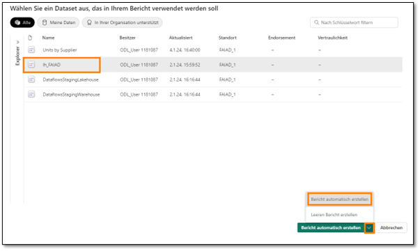

# Inhalt

- Einführung

- Power BI

    - Aufgabe 1: Bericht automatisch erstellen

    - Aufgabe 2: Standardtabellen (Metriken) ausblenden
    
    - Aufgabe 3: Hintergrund für einen neuen Bericht konfigurieren
    
    - Aufgabe 4: Dem Bericht eine Kopfzeile hinzufügen
    
    - Aufgabe 5: Dem Bericht KPIs hinzufügen
    
    - Aufgabe 6: Dem Bericht ein Liniendiagramm hinzufügen
    
    - Aufgabe 7: Spalte „Year“ in der Tabelle „Date“ konfigurieren
    
    - Aufgabe 8: Die Spalte „Short_Month_Name“ in der Tabelle „Date“ konfigurieren
    
    - Aufgabe 9: Liniendiagramm formatieren
    
    - Aufgabe 10: Neue Daten hinzufügen, um den Direct Lake-Modus zu simulieren

- Übungsumgebung bereinigen

- Referenzen

## Einführung 

Wir haben Daten aus verschiedenen Datenquellen in Lakehouse erfasst, eine Einführung in Lakehouse erhalten, ein Datenmodell erstellt und einen Aktualisierungsplan für die Datenquellen festgelegt. Jetzt erstellen wir einen Bericht.

Inhalt dieser Übung: 
- So erstellen Sie einen Bericht automatisch
- So erstellen Sie einen Bericht von einem leeren Canvas ausgehend
- So erkunden Sie den Direct Lake-Modus, in dem Daten automatisch aktualisiert werden

## Power BI

### Aufgabe 1: Bericht automatisch erstellen

Verwenden wir zunächst die Option „Bericht automatisch erstellen“. Und später in der Übung werden wir den Bericht, den wir in Power BI haben, neu erstellen.

1. Wir navigieren zurück zum **Fabric-Arbeitsbereich**, den Sie in der vorherigen Übung erstellt haben.
2. Sie befinden sich wahrscheinlich auf der Data Factory-Startseite. Wählen Sie unten links das **Data Factory-Symbol** aus.
3. Das Dialogfeld „Fabric-Funktionsbereich“ wird geöffnet. Wählen Sie **Power BI** aus. Sie werden zur **Power BI-Startseite** weitergeleitet.

    
 
4. Wählen Sie **Neuer Bericht** aus dem oberen Menü aus.

    
 
5. Sie werden zu **Erstellen Sie Ihren ersten Bericht** weitergeleitet. Dort sind Optionen verfügbar, um Daten manuell einzugeben und einen Bericht zu erstellen oder um ein veröffentlichtes semantisches Modell auszuwählen. In den vorherigen Übungen haben wir ein semantisches Modell erstellt. Lassen Sie uns das verwenden. Wählen Sie die Option **Veröffentlichtes Semantikmodell auswählen** aus.

    
 
6. Die Seite „Ein in Ihrem Bericht zu verwendendes DataSet auswählen“ wird geöffnet. Beachten Sie, dass wir über vier Optionen verfügen. **Wählen Sie lh_FAIAD aus:**

    a. **lh_FAIAD:** Dies ist das Lakehouse mit dem DataSet, den wir erstellt haben und für den Bericht verwenden möchten.

    b. **Units by Supplier:** Dies ist das DataSet, das wir mit T-SQL erstellt haben.

    c. **DataflowsStagingWarehouse:** Dies ist das Staging Warehouse, das standardmäßig erstellt wird, das wir es nicht verwendet und keine Daten bereitgestellt haben.
    
    d. **DataflowsStagingLakehouse:** Dies ist das Staging Lakehouse, das standardmäßig erstellt wird, das wir es nicht verwendet und keine Daten bereitgestellt haben.

7. Klicken Sie auf den **Pfeil neben der Schaltfläche „Bericht automatisch erstellen“**. Beachten Sie, dass es zwei Optionen gibt: „Bericht automatisch erstellen“ und „Leeren Bericht erstellen“. Versuchen wir es mit der automatischen Erstellung. Wählen Sie daher **Bericht automatisch erstellen** aus.

    

8. Power BI beginnt mit der automatischen Erstellung des Berichts. Beachten Sie, dass bei entsprechender Auswahl eine Option für die Vorauswahl verschiedener Daten vorhanden ist. Sobald der Bericht fertig ist, wird oben rechts auf dem Bildschirm ein Dialogfeld angezeigt. Wählen Sie **Bericht jetzt anzeigen** aus.

    
 
**Prüfpunkt:** Sie erhalten einen Bericht, der wie im folgenden Screenshot aussieht. Es gibt einige KPIs und einige Trendvisualisierungen. Dies ist ein guter Ausgangspunkt, wenn Sie ein neues Modell analysieren und sofort starten müssen.

**Hinweis:** Im oberen Menü haben Sie die Möglichkeit, den Bericht zu bearbeiten oder einige der Daten als Tabellen anzuzeigen. Sehen Sie sich diese Optionen doch einmal genauer an.

9. Sobald Sie fertig sind, **reduzieren** Sie alle Tabellen im Abschnitt **Daten** rechts. Beachten Sie, dass wir fünf neue Tabellen haben, die nicht Teil des von uns erstellten Modells sind. Hierbei handelt es sich um Standardtabellen, die zur Analyse der Leistung hinzugefügt wurden. Wir werden diese in Kürze aus der Berichtsansicht entfernen.

10. Speichern wir diesen Bericht. Wählen Sie im oberen Menü **Speichern** aus.

11. Das Dialogfeld „Bericht speichern“ wird geöffnet. Geben Sie dem Bericht den Namen **rpt_Sales_Auto_Report**.

**Hinweis:** Wir stellen dem Berichtsnamen das Präfix „rpt“ voran, was für „Bericht“ steht.

12. Stellen Sie sicher, dass der Bericht unter **<Name Ihres Arbeitsbereichs>** gespeichert wird.

13. Wählen Sie **Speichern** aus.

    

### Aufgabe 2: Standardtabellen (Metriken) ausblenden

Erstellen wir einen Bericht wie den in Power BI Desktop. Dazu beginnen wir mit einem leeren Canvas. Bevor wir mit der Erstellung eines Berichts beginnen, entfernen wir die Standardtabellen (siehe Screenshot oben) aus der Berichtsansicht. Dies erfolgt im Modellierungsabschnitt von Lakehouse.

1. Wählen Sie unten im linken Bereich das **Power BI-Symbol** aus. Das Dialogfeld „Fabric“ wird geöffnet.

2. Klicken Sie auf **Data Engineering**. Sie werden zur Startseite von Data Engineering weitergeleitet.

    
 
3. Scrollen Sie nach unten zum Abschnitt **Schnellzugriff**.

4. Wählen Sie **lh_FAIAD -> SQL-Analyseendpunkt** aus. Wir befinden uns in der Datenansicht von Lakehouse.

5. Wählen Sie unten **im linken Bereich Modell** aus, um zur Modellansicht zu navigieren.

Beachten Sie, dass sich die Standardtabellen im Designcanvas befinden. (Sie müssen möglicherweise nach rechts oder unten scrollen, um sie anzuzeigen.)

6. Klicken Sie mit der rechten Maustaste auf die Tabelle **long_running_queries**, und wählen Sie **In Berichtsansicht ausblenden** aus.

    
 
7. Wählen Sie entsprechend die Option **In Berichtsansicht ausblenden** für die folgenden Tabellen aus:

    a. fabric_query_starting
    
    b. fabric_query_completed
    
    c. exec_requests_history
    
    d. frequently_run_queries

### Aufgabe 3: Hintergrund für einen neuen Bericht konfigurieren

1. Jetzt können wir einen neuen Bericht übe die Modellansicht erstellen. Wählen Sie im oberen Menü **Start -> Neuer Bericht** aus. Sie werden zum Power BI-Berichtscanvas in einem neuen Fenster/einer neuen Registerkarte in Ihrem Browser weitergeleitet.

    
 
2. Öffnen Sie, sofern noch nicht geschehen, auf dem **Desktop** Ihrer Übungsumgebung im Ordner **Report** die Datei **FAIAD.pbix**.

Wir werden diesen Bericht als Referenz verwenden. Wir fügen zunächst den Canvashintergrund hinzu. Wir erstellen die Berichtskopfzeile, fügen einige KPIs hinzu und erstellen das Liniendiagramm „Verkäufe im Laufe der Zeit“. Aus Zeitgründen und davon ausgehend, dass Sie bereits Erfahrung mit der Erstellung von Visuals Power BI Desktop haben, werden wir nicht alle Visuals erstellen.

 
3. Navigieren Sie zurück zum **Power BI-Canvas** in Ihrem Browser.

4. Wählen Sie im Visualisierungsbereich das 
**Symbol** für die **Formatseite** aus.

5. Erweitern Sie den **Abschnitt „Canvas-Hintergrund“** aus.

6. Wählen Sie **Durchsuchen** über die Option **Bild** aus. Das Dialogfeld „Datei-Explorer“ wird geöffnet.

7. Navigieren Sie auf dem **Desktop** Ihrer Übungsumgebung zum Ordner **Report**. 

8. Wählen Sie **Summary Background.png** aus.

9. Wählen Sie im Dropdownmenü **Bild anpassen** den Eintrag **Anpassen** aus.

10. Legen Sie die Transparenz auf **0 %** fest.

    
 

### Aufgabe 4: Dem Bericht eine Kopfzeile hinzufügen

1. Wir fügen nun die Kopfzeile am oberen Rand hinzu. Wählen Sie im **Menü** die Option **Textfeld** aus.

2. Geben Sie **Fabrikam Company** als erste Zeile in das Textfeld ein.

3. Geben Sie als zweite Zeile **Sales Report** in das Textfeld ein.

4. Markieren Sie **Fabrikam Company**, und legen Sie **Schriftart** auf **Segoe UI** und **Schriftgröße** auf **18, Fett** fest.

5. Markieren Sie Sales Report, und legen Sie **Schriftart** auf **Segoe UI** und **Schriftgröße** auf **14** fest.

6. Erweitern Sie bei **ausgewähltem Textfeld** im Bereich „Format“ rechts die Option **Effekte**.

7. Verwenden Sie den Schieberegler **Hintergrund**, um ihn auf **Aus** festzulegen.

8. Passen Sie die Größe des **Textfelds so an, dass es in den oberen Rand passt**.

    
 

### Aufgabe 5: Dem Bericht KPIs hinzufügen

1. Fügen wir nun Verkauf-KPI hinzu. Wählen Sie den **Leerraum** im Canvas aus, um den Fokus vom Textfeld zu entfernen.

2. Wählen Sie im **Abschnitt Visualisierungen** die Option **Mehrzeiliges Kartenvisual** aus.

3. Erweitern Sie im **Abschnitt „Daten“** die **Tabelle Sales**.

4. Wählen Sie **Kennzahl „Sales“** aus.

    
 
5. Wenn das **mehrzeilige Kartenvisual ausgewählt ist**, wählen Sie das **Symbol „Visual formatieren“** im Abschnitt „Visualisierungen“ aus.

6. Erweitern Sie den Abschnitt **Kategoriebeschriftungen** aus.

7. Erhöhen Sie die **Schriftgröße** auf **14**.

8. Wählen Sie das **Dropdownmenü „Farbe“** aus. Das Dialogfeld „Farbpalette“ wird geöffnet.

9. Legen Sie den HEX-Wert auf **#004753** fest.

    
 
10. Erweitern Sie den Abschnitt **Karten**.

11. Verwenden Sie den Schieberegler **Akzentleiste**, um ihn auf Aus festzulegen.

    
 
12. Wählen Sie im Visualisierungsbereich **Allgemein** aus.

13. Erweitern Sie den **Abschnitt „Effekte“**.

14. Verwenden Sie den Schieberegler **Hintergrund**, um ihn auf **Aus** festzulegen.

15. Ändern Sie die Größe des **Visuals**, und verschieben Sie es in das **linke Feld, wie im Screenshot dargestellt**.

    
 
16. Fügen wir nun einen weiteren KPI hinzu. Wählen Sie die soeben erstellte **mehrzeilige Sales-Karte** aus. **Kopieren Sie** das Visual, indem Sie **STRG+C** auf Ihrer Tastatur auswählen.

17. **Fügen Sie** das Visual ein, indem Sie **STRG+V** auf Ihrer Tastatur auswählen. Beachten Sie, dass das Visual in das Canvas eingefügt wird.

18. Wenn das **neue Visual hervorgehoben ist**, entfernen Sie im Abschnitt **Visualisierungsbereich -> Visual erstellen -> Felder** die Kennzahl **Sales**.

19. Erweitern Sie im Abschnitt **Daten** die Tabelle **Sales**, und wählen Sie die Kennzahl **Units** aus.

20. Ändern Sie die Größe des **Visuals** und **platzieren Sie es im Feld unter dem Sales-Visual**.

    

